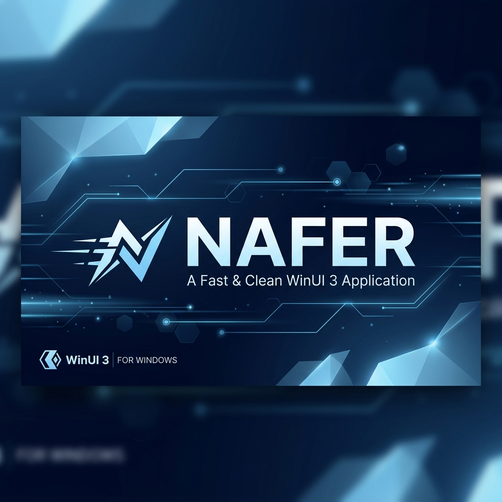

<div align="center">
  
  
  # Nafer (نافر)
  
  **A Clean, Fast, and Beautifully Engineered Content Hub for WinUI 3.**

  [](https://dotnet.microsoft.com/)
  [](https://learn.microsoft.com/en-us/windows/apps/winui/winui3/)
  [](LICENSE)
  [](https://www.microsoft.com/windows)

</div>

---

## 🚀 Overview

**Nafer** is a premium content hub designed with a focus on speed, minimalism, and enterprise-grade architecture. Built using the latest **WinUI 3** and **.NET 9** technologies, it provides a seamless user experience for discovering and managing content with a native Windows 11 aesthetic.

## ✨ Key Features

- 💎 **Modern WinUI 3 Interface**: Fully responsive design following Windows 11 Fluent Design System guidelines.
- 🔄 **Autonomous Auto-Update**: Industry-standard update system that checks, downloads, and installs updates in the background.
- ⚙️ **Advanced Settings**: Granular control over application behavior, update notifications, and download visibility.
- 🌓 **Dynamic Theming**: Support for Light, Dark, and System theme switching with smooth transitions.
- 🔋 **System Tray Integration**: Minimize to tray support with quick-access notifications.
- 🏗️ **Enterprise Architecture**: Built on **Hexagonal/Clean Architecture** principles for infinite scalability and modularity.

## 🏗️ Technical Architecture

Nafer follows a strict separation of concerns to ensure the codebase remains maintainable as it grows:

- **`Nafer.Core`**: The heart of the application containing domain models, business logic interfaces, and core exceptions. Zero external dependencies.
- **`Nafer.Infrastructure`**: Implementation details including specialized services for local settings, background updates, and file management.
- **`Nafer.WinUI`**: The presentation layer using the **MVVM** pattern, powered by **ReactiveUI** for high-performance reactive data binding.
- **`Nafer.Installer`**: A professional deployment project using the **WiX Toolset v5** for generating stable MSI packages.

## 🛠️ Tech Stack

- **Framework**: WinUI 3 (Windows App SDK 1.8)
- **Runtime**: .NET 9.0
- **Logic**: ReactiveUI, Fody, Serilog
- **Build System**: PowerShell-based master build script
- **Installer**: WiX Toolset v5

## 🏁 Getting Started

### Prerequisites

- [Visual Studio 2022](https://visualstudio.microsoft.com/) (with .NET Desktop Development workload)
- [Windows App SDK](https://learn.microsoft.com/en-us/windows/apps/windows-app-sdk/stable-channel)
- [WiX Toolset v5](https://wixtoolset.org/)

### Quick Start

1. Clone the repository.
2. Open `Nafer.slnx` in Visual Studio.
3. Run the project:
   ```powershell
   dotnet run --project src\Nafer.WinUI\Nafer.WinUI.csproj
   ```
4. To build the production installer:
   ```powershell
   .\Build.ps1
   ```

## 📄 License

This project is licensed under the **MIT License** - see the [LICENSE](LICENSE) file for details.

---

<div align="center">
  Built with ❤️ by the Nafer Team
</div>
